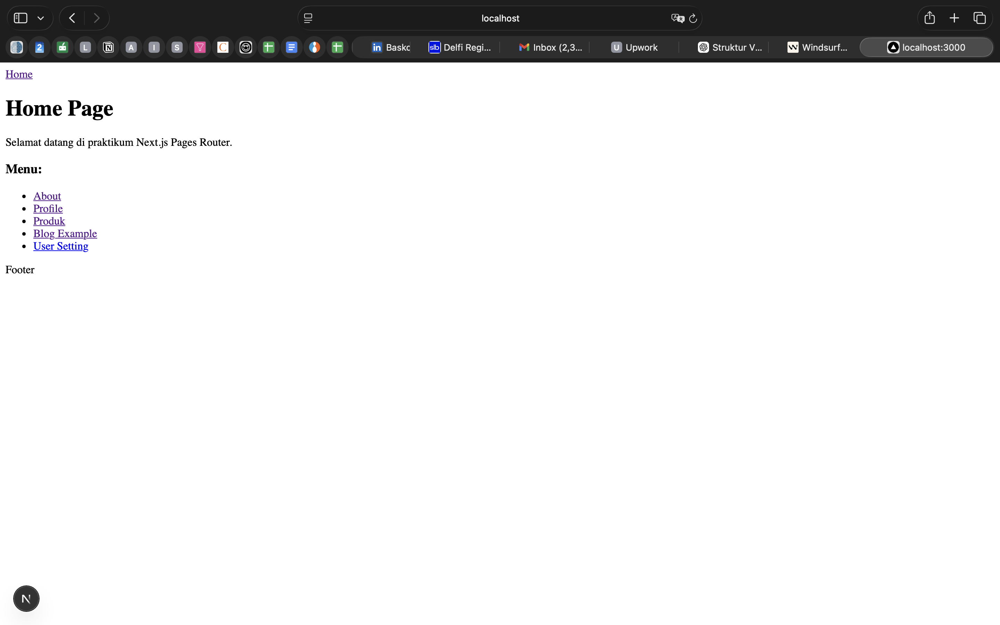

# W3 - Next.js Pages Router — Assignment Report

---

## E. Tugas Praktikum

---

### Tugas 1 – Routing

**Instructions:**
1. Create the following pages:
   - `/profile`
   - `/profile/edit`
2. Make sure routing works without errors

**Answer:**

---

### Tugas 2 – Dynamic Routing

**Instructions:**
1. Create the following route:
   - `/blog/[slug]`
2. Display the `slug` value on the page

**Answer:**

---

### Tugas 3 – Layout

**Instructions:**
1. Add a Footer to the AppShell
2. Footer should appear on all pages

**Answer:**

---

## F. Reflection Questions

### 1. What is the difference between file-based routing and manual routing?

Because in Next.js, the routing system is determined directly by the file structure inside the `pages` folder. For example:
- `pages/index.js` → `/`
- `pages/profile.js` → `/profile`
- `pages/blog/[slug].js` → `/blog/[slug]`

This means URLs are **automatically created based on the file name** — no manual route configuration needed. Manual routing (like React Router) requires you to explicitly define every route in a configuration file.

---

### 2. Why is dynamic routing important in web applications?

Dynamic routing allows a single page template to handle multiple URLs with variable parameters (e.g., `/blog/[slug]`). This is essential for scalable applications where content is data-driven — such as blog posts, user profiles, or product pages — without needing to create a separate page file for every individual entry.

---

### 3. What are the advantages of using a global layout compared to calling components one by one?

Using a global layout ensures consistency across all pages — elements like Navbar, Footer, and Sidebar only need to be defined once. It reduces code duplication, makes maintenance easier (one change applies everywhere), and keeps individual page files clean and focused on their own content.

| Approach | Global Layout | Per-page Components |
|---|---|---|
| **Code Duplication** | None | High |
| **Consistency** | Guaranteed | Prone to mistakes |
| **Maintenance** | Easy (change once) | Hard (change everywhere) |
| **Page File Cleanliness** | ✅ Clean | ❌ Cluttered |