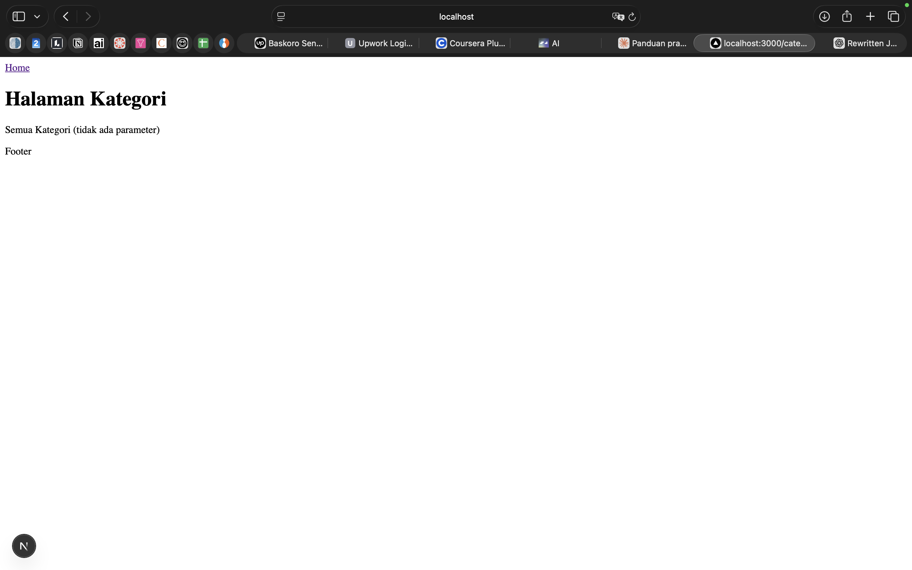
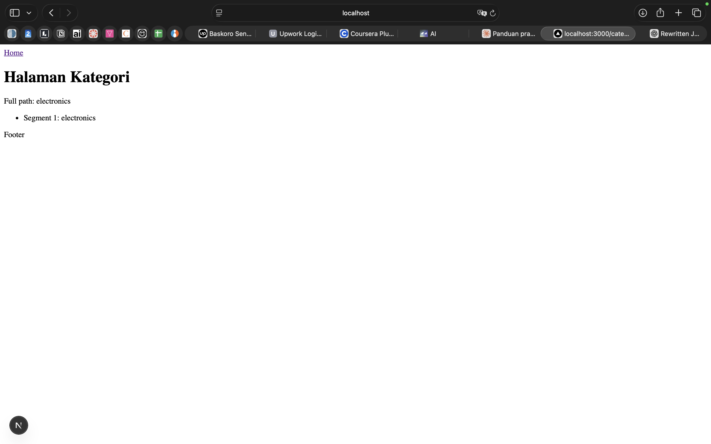
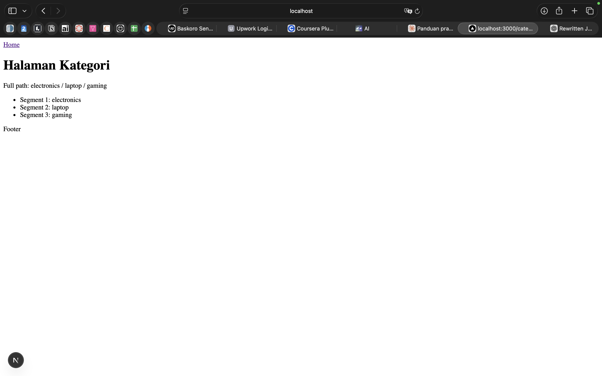
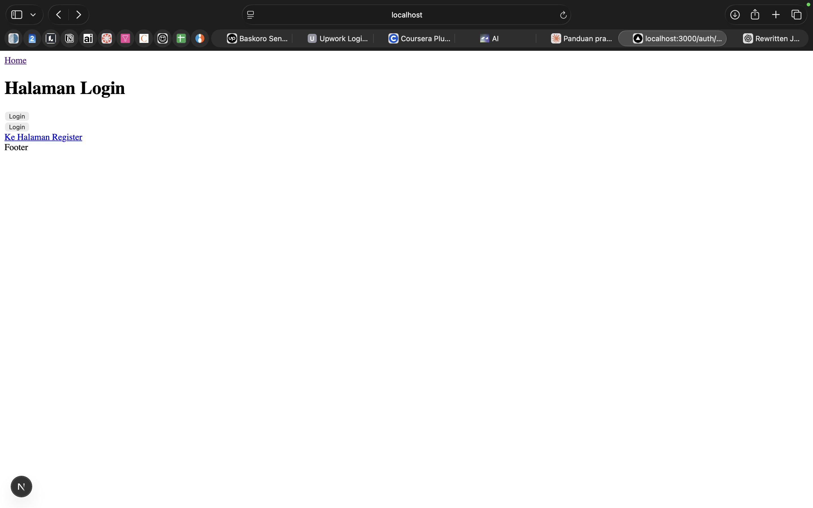
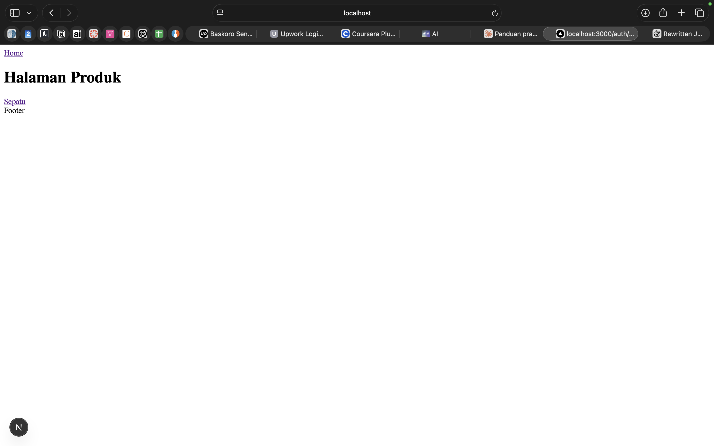
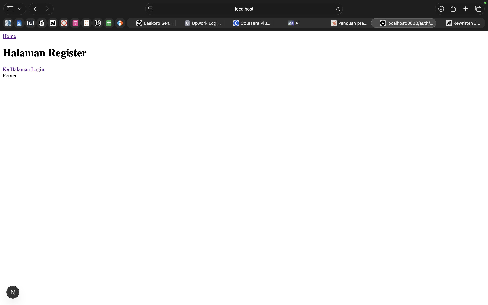

# W4 – Navigation Link
---

## Task 1 – Catch-All Route

### Description
Create a catch-all route at `/category/[...slug]` that displays all URL parameters as a list on the page.

### File Structure
```
src/
└── pages/
    └── category/
        └── [[...slug]].tsx
```

### URL Test Cases

| URL Accessed | Expected Output |
|-------------|----------------|
| `/category` | "All Categories (no parameters provided)" |
| `/category/electronics` | List: Segment 1: electronics |
| `/category/electronics/laptop` | List: Segment 1: electronics, Segment 2: laptop |
| `/category/electronics/laptop/gaming` | List: Segment 1–3 all filled |

### Screenshots / Evidence

>**Screenshot 1 – Accessing `/category` (no parameters)**


---

>**Screenshot 2 – Accessing `/category/electronics`**

---

>**Screenshot 3 – Accessing `/category/electronics/laptop/gaming`**


---

## Task 2 – Navigation

### Description
Build a complete navigation system:
- **Login → Product** using imperative navigation (`router.push`)
- **Login ↔ Register** using the `Link` component (declarative)

### File Structure
```
src/
└── pages/
    ├── auth/
    │   ├── login.tsx
    │   └── register.tsx
    └── produk/
        └── index.tsx
```

### Test Cases

| Action | Expected Result |
|--------|----------------|
| Click "Login" button on `/auth/login` | Navigates to `/produk` without page reload |
| Click "Go to Register Page" link | Navigates to `/auth/register` |
| Click "Go to Login Page" link | Navigates back to `/auth/login` |

### Screenshots / Evidence

> **Screenshot 1 – Login page display**


---

> **Screenshot 2 – After clicking Login button → Product page is shown**


---

> **Screenshot 3 – Login ↔ Register navigation using Link**


---

## Task 3 – Automatic Redirect

### Description
Implement an automatic redirect to the login page if the user is not logged in. The simulation uses `useState` with an initial value of `false` (not logged in).


### Test Cases

| Condition | Action | Expected Result |
|-----------|--------|----------------|
| `isLogin = false` | Access `/produk` | Automatically redirected to `/auth/login` |
| `isLogin = true` | Access `/produk` | Product page renders normally |

### Screenshots / Evidence

> 📸 **Screenshot 1 – Accessing `/produk` is immediately redirected to `/auth/login`**


---

> 📸 **Screenshot 2 – URL bar shows the change from `/produk` to `/auth/login`**


---

## Evaluation Questions

### 1. What is the difference between `[id].js` and `[...slug].js`?

| Aspect | `[id].js` | `[...slug].js` |
|--------|-----------|----------------|
| **Segments captured** | Exactly **1 segment** | **1 or more segments** |
| **Value type** | `string` | `string[]` (array) |
| **Matching URL example** | `/product/123` | `/shop/clothes/tops/t-shirt` |
| **Non-matching URL** | `/product/a/b` → 404 error | – |
| **How to access** | `router.query.id` → `"123"` | `router.query.slug` → `["clothes","tops","t-shirt"]` |

**Summary:** `[id].js` is for capturing a single dynamic URL parameter, while `[...slug].js` is designed to capture multiple URL segments at once, returning them all as an array.

---

### 2. Why is `slug` in the form of an array?

Because `[...slug]` is designed to capture **multiple URL segments** at once. Each part of the URL separated by `/` becomes one element in the array.

**Example:**

```
URL: /shop/clothes/tops/t-shirt

query.slug = ["clothes", "tops", "t-shirt"]
              index[0]   index[1]  index[2]
```

By having it as an array, we can flexibly process each segment — for example using `.join()`, `.map()`, or accessing a specific index. If it were just a string, we would lose the ability to work with each segment independently.

---

### 3. When should you use `Link` vs `router.push()`?

| | `Link` (Declarative) | `router.push()` (Imperative) |
|--|---------------------|------------------------------|
| **When to use** | Static navigation always visible in the UI, such as menus, "Back" buttons, etc. | Navigation triggered by logic or conditions (after form submit, after login, etc.) |
| **How it works** | Renders an `<a>` element in HTML | Called inside a JavaScript function |
| **Example** | `<Link href="/about">About</Link>` | `push("/dashboard")` after a successful login |
| **SEO** | ✅ Better for SEO | Less optimal for SEO |
| **Accessibility** | ✅ More accessible by default | Needs additional handling |

**Conclusion:** Use `Link` for static navigation rendered in the UI. Use `router.push()` for dynamic, condition-based navigation triggered by a user action or event.

---

### 4. Why does Next.js navigation not refresh the page?

Next.js uses a technique called **Client-Side Navigation**. Here is how it works:

1. **Next.js is a React-based framework (SPA behavior):** After the first page load, navigating between pages is handled by JavaScript on the client side — not by fetching a new HTML document from the server.

2. **`Link` and `router.push()` use the browser's History API:** URL changes are performed via `window.history.pushState()`, so the URL updates without triggering a full page reload.

3. **Only the changed components are re-rendered:** React uses a reconciliation process to only update the parts of the DOM that have actually changed, not the entire page.

4. **Result:** Navigation feels instant, there is no white flash between pages, and application state is preserved across page transitions.